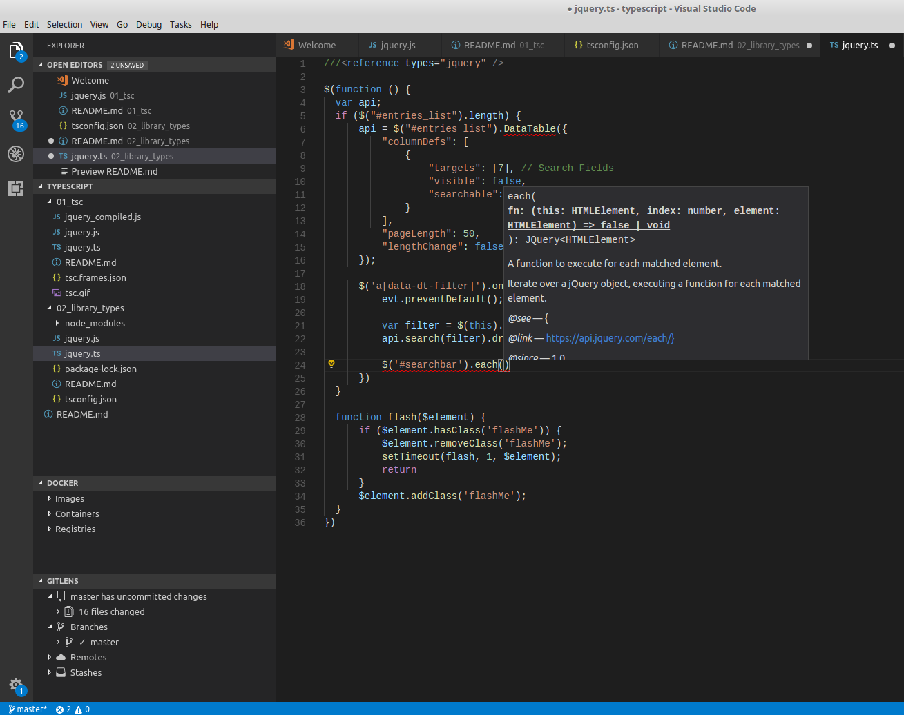
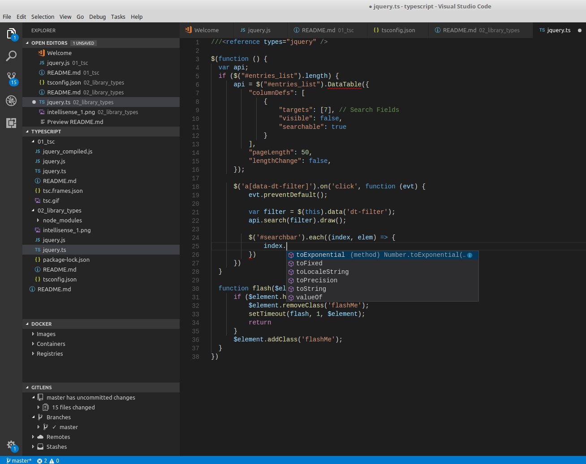

[In the last section](../01_tsc) we looked at using the typescript compiler `tsc`
to compile typescript files to javascript.  Now we'll look at what actually makes
typescript useful.

# DefinitelyTyped

When Typescript was first getting started, a group called [DefinitelyTyped](http://definitelytyped.org/)
took up the task of writing TypeScript definitions for every library in NPM.
Nowadays a significant number of NPM modules have type definitions, and the
types live in the [`@types` organization on NPM](https://www.npmjs.com/~types).

What this means is that you can very easily grab a type definiton for a popular
library like JQuery and reference it in your typescript projects, *even if it's
not a typescript library!*

Let's take our `jquery.ts` from the last example and modify it to use the JQuery
definitions from NPM.  First we'll download the definitions from npm:

```bash
$ npm install @types/jquery@3.2.15
```

Then we'll create a `tsconfig.json` file to set compiler options for our typescript project.
Don't worry I've done this for you.

Finally we'll modify our source file to reference those definitions.

```diff
1c1
< declare var $: any
---
> ///<reference types="jquery" />
```

Now what does `tsc` tell us?

```
$ tsc
jquery.ts(6,32): error TS2339: Property 'DataTable' does not exist on type 'JQuery<HTMLElement>'.
```

It's telling us that it doesn't know about JQuery DataTables.  Well thats easy, all we have to do
is include the type definitions from NPM!

```
npm install @types/datatables.net
```

Now tsc doesn't complain anymore!

# IntelliSense

Intellisense is the #1 best thing about TypeScript.  Compile time errors are great at catching
bugs, but you're not really making TypeScript work *for* you.  In fact it can often feel
like Typescript is working against you.

Not with Intellisense!  It's automatically built into visual studio code:




And there's a number of vim plugins as well, such as: https://github.com/Valloric/YouCompleteMe

IntelliSense (aka AutoCompletion) is about 50% of what makes TypeScript good.  If you define
your types well, not only do you get type safety through your entire JavaScript app, but
you save a ton of time reading third-party NPM module documentation.  It's a huge boon
for productivity.  

It's such a boon that in the past, when there hasn't been an available definition
file for a library I needed, I wrote it myself.  I invested some time to read once through
the documentation, and code up my understanding as a definitions file which I refer to
through IntelliSense.